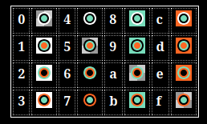

# Learning 

We use this tutorial to be familiar with uxn 
https://compudanzas.net/uxn_tutorial.html

Colors from set_palettes have to be red in columns
col1 -> color 1
col2 -> color 2
col3 -> color 3
col4 -> color 4

# Tooling 

## Language 

We use chibicc to convert C89 code to uxntal 
https://github.com/lynn/chibicc/tree/uxn

A binary version of chibicc is present in this project.

## Sprites 

To convert modern images (such as png) to .chr, we use 
https://www.make.vg/brewtool/chr/index.html